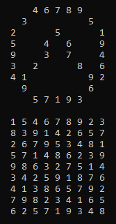

## About
Sudoku solver in C++  
Works for all puzzles that don't require number guessing  

## Example
```cpp
#include "board.h"


int main()
{
	board example = { "//46789///3/////5/2///5///15//4/6//99//3/7//43/2///8/641/////92/9/////6///57193//" };
	example.display();

	example.solve();
	example.display();


	std::cin.get();
}
```


